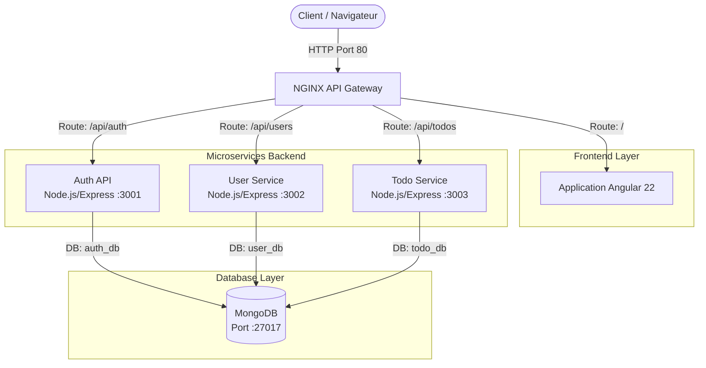

# Mini ToDo Platform - Microservices Architecture

Une plateforme full-stack de gestion de tâches (ToDo list) conçue avec une architecture moderne basée sur les **microservices**. .

##  Architecture du Projet

Le système est découpé en plusieurs services indépendants qui communiquent de manière transparente grâce à une API Gateway.



### Explication des composants :
1. **Frontend (Angular)** : Une interface utilisateur riche (UI) utilisant les concepts de *Smart & Dumb components*. Ne communique qu'avec la Gateway de manière agnostique.
2. **API Gateway (NGINX)** : Agit comme le point d'entrée unique. Redirige le trafic web vers le frontend et les requêtes `/api/*` vers le bon microservice en arrière-plan.
3. **Microservices (Node.js/Express)** :
   - **Auth-API** : Gère l'inscription, la connexion et génère les tokens JWT.
   - **User-Service** : Gère la lecture et la mise à jour des profils utilisateurs.
   - **Todo-Service** : Gère le CRUD des tâches de chaque utilisateur.
4. **Base de données (MongoDB)** : Une instance MongoDB hébergeant trois bases de données logiques séparées pour respecter l'indépendance des microservices.

---

##  Technologies Utilisées

- **Frontend** : Angular 22, TypeScript, CSS (Glassmorphism & Variables natives)
- **Backend** : Node.js, Express.js, Mongoose
- **Sécurité** : JWT (JSON Web Tokens), Intercepteurs HTTP Angular, Guard Routes
- **Base de données** : MongoDB 7.0
- **Infrastructure & Déploiement** : Docker, Docker Compose, NGINX

---

##  Démarrage Rapide (Installation)

### Prérequis
- [Docker](https://docs.docker.com/get-docker/) et [Docker Compose](https://docs.docker.com/compose/install/) installés sur votre machine.
- Le port `80` de votre machine doit être libre.

### Lancer le projet
1. Clonez ce dépôt sur votre machine locale :
   ```bash
   git clone https://github.com/Ousshadd/Mini-ToDo.git
   cd Mini_ToDo
   ```

2. Démarrez l'ensemble des conteneurs grâce à Docker Compose :
   ```bash
   docker-compose up --build
   ```

3. Une fois les conteneurs démarrés, ouvrez votre navigateur à l'adresse :
   👉 **http://localhost**

> **Note :** Au premier lancement, la construction de l'image Angular peut prendre quelques minutes. Les démarrages suivants seront instantanés.

---

##  Accès aux données

Vous pouvez interagir avec la base de données de l'application (pour vérifier que les services enregistrent bien les données) avec **MongoDB Compass** ou un client NoSQL en utilisant cette URI :
```text
mongodb://localhost:27017
```

---

##  Structure des Dossiers

```text
Mini_ToDo/
├── backend/
│   ├── auth-api/        # Microservice d'Authentification
│   ├── todo-service/    # Microservice des Tâches
│   └── user-service/    # Microservice Utilisateurs
├── frontend/
│   └── toDo/            # Code source Angular 22
├── nginx/
│   └── nginx.conf       # Configuration du Proxy Inverse
├── docker-compose.yml   # Orchestration de tous les conteneurs
└── README.md
```

##  Auteur
*Développé dans le cadre du module Microservices.*
