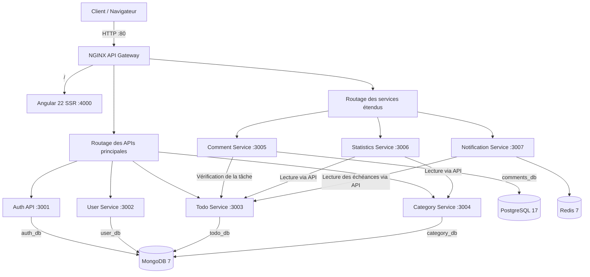

# Mini ToDo Platform — Architecture Microservices

Mini ToDo est une plateforme full-stack de gestion de tâches conçue pour démontrer une architecture microservices, la communication interservices et la persistance polyglotte.

L'application combine plusieurs technologies backend et plusieurs systèmes de stockage : **Node.js/Express**, **Python/FastAPI**, **MongoDB**, **PostgreSQL** et **Redis**. Chaque microservice possède une responsabilité précise et reste propriétaire de ses données.

## Fonctionnalités

- Inscription et connexion sécurisées par JWT
- Création, consultation, modification et suppression de tâches
- Gestion des priorités, statuts, échéances et catégories
- Ajout, consultation, modification et suppression de commentaires
- Statistiques de productivité par statut, priorité, catégorie et semaine
- Alertes pour les tâches dépassées ou arrivant à échéance dans moins de 24 heures
- Isolation des données de chaque utilisateur
- Interface Angular responsive avec mises à jour optimistes

## Architecture globale



Le navigateur communique uniquement avec NGINX. La Gateway redirige chaque requête `/api/*` vers le microservice correspondant.

Les services Statistics, Notification et Comment ne lisent jamais directement la base MongoDB du Todo Service. Ils communiquent avec lui par HTTP en transmettant le JWT de l'utilisateur.

## Microservices

| Service | Responsabilité | Technologie | Stockage | Port |
|---|---|---|---|---:|
| Auth API | Inscription, connexion et génération des JWT | Node.js, Express, Mongoose | MongoDB `auth_db` | 3001 |
| User Service | Gestion des profils utilisateurs | Node.js, Express, Mongoose | MongoDB `user_db` | 3002 |
| Todo Service | CRUD des tâches et isolation par utilisateur | Node.js, Express, Mongoose | MongoDB `todo_db` | 3003 |
| Category Service | CRUD des catégories personnelles | Node.js, Express, Mongoose | MongoDB `category_db` | 3004 |
| Comment Service | CRUD des commentaires associés aux tâches | Node.js, Express, `pg` | PostgreSQL `comments_db` | 3005 |
| Statistics Service | Calcul des indicateurs de productivité | Python, FastAPI, HTTPX | Aucun stockage propre | 3006 |
| Notification Service | Détection et état des alertes d'échéance | Python, FastAPI | Redis | 3007 |

## Persistance polyglotte

Le projet utilise le stockage le plus adapté à chaque responsabilité :

- **MongoDB** stocke les utilisateurs, tâches et catégories sous forme de documents.
- **PostgreSQL** stocke les commentaires dans une table relationnelle avec index.
- **Redis** conserve rapidement l'état temporaire des notifications lues ou supprimées.
- **Statistics Service** calcule ses résultats à la demande en interrogeant les APIs Todo et Category, sans accéder à leurs bases.

Cette séparation illustre le principe **Database per Service** : aucun microservice ne partage directement les tables ou collections internes d'un autre service.

## Technologies utilisées

### Frontend

- Angular 22
- TypeScript
- Angular Signals et Computed Signals
- Angular HttpClient, Interceptor et Route Guard
- Angular SSR
- CSS natif et design Glassmorphism

### Backend

- Node.js 20 et Express.js
- Python 3.12 et FastAPI
- Uvicorn
- Mongoose
- `pg` pour PostgreSQL
- HTTPX pour la communication interservices
- PyJWT et `jsonwebtoken`

### Données et infrastructure

- MongoDB 7
- PostgreSQL 17
- Redis 7
- Docker et Docker Compose
- NGINX comme API Gateway et reverse proxy

## Sécurité et isolation

Après la connexion, l'Auth API génère un JWT valable 24 heures. L'intercepteur Angular ajoute automatiquement ce token aux requêtes :

```http
Authorization: Bearer <token>
```

Chaque microservice vérifie la signature du JWT avec le même secret. Les requêtes Todo, Category et Comment filtrent les données avec l'identifiant de l'utilisateur contenu dans le token.

Les secrets et mots de passe présents dans `docker-compose.yml` sont uniquement destinés au développement local. Pour un déploiement réel, ils doivent être placés dans des variables d'environnement protégées ou dans un gestionnaire de secrets.

## Principales routes API

Toutes les routes passent par `http://localhost` et NGINX.

| Méthode | Route | Description |
|---|---|---|
| POST | `/api/auth/register` | Créer un compte |
| POST | `/api/auth/login` | Se connecter |
| GET | `/api/auth/me` | Obtenir le profil authentifié |
| GET/POST | `/api/todos` | Lister ou créer des tâches |
| GET/PUT/DELETE | `/api/todos/:id` | Consulter, modifier ou supprimer une tâche |
| GET/POST | `/api/categories` | Lister ou créer des catégories |
| PUT/DELETE | `/api/categories/:id` | Modifier ou supprimer une catégorie |
| GET | `/api/comments/task/:todoId` | Lister les commentaires d'une tâche |
| POST | `/api/comments` | Ajouter un commentaire |
| PUT/DELETE | `/api/comments/:id` | Modifier ou supprimer un commentaire |
| GET | `/api/statistics` | Calculer les statistiques de l'utilisateur |
| GET | `/api/notifications` | Détecter et retourner les alertes |
| PUT | `/api/notifications/:todoId/read` | Marquer une alerte comme lue |
| DELETE | `/api/notifications/:todoId` | Masquer une alerte |

Les routes métier sont protégées par JWT. Les nouveaux services exposent également une route publique `/health` pour faciliter leur supervision.

## Installation et démarrage

### Prérequis

- Git
- Docker Desktop avec Docker Compose
- Port `80` libre
- Ports `27017`, `5432` et `6379` libres si l'accès direct aux bases est souhaité

Il n'est pas nécessaire d'installer Node.js, Angular, Python, MongoDB, PostgreSQL ou Redis localement : Docker construit et exécute tous les composants.

### Lancer le projet

```bash
git clone https://github.com/Ousshadd/Mini-ToDo.git
cd Mini-ToDo
docker compose up --build
```

Au premier lancement, le téléchargement des images et la compilation Angular peuvent prendre quelques minutes.

Ouvrir ensuite :

```text
http://localhost
```

### Exécution en arrière-plan

```bash
docker compose up -d --build
```

### Arrêter les services

```bash
docker compose down
```

Les données sont conservées dans les volumes Docker. Ne pas utiliser `docker compose down -v` si vous souhaitez conserver les comptes, tâches, commentaires et états des alertes.

## Vérification des services

```text
http://localhost/api/auth/health
http://localhost/api/comments/health
http://localhost/api/statistics/health
http://localhost/api/notifications/health
```

Dans l'implémentation actuelle, les routes de santé des services User, Todo et Category traversent leur middleware JWT et nécessitent donc un token valide.

Afficher l'état des conteneurs :

```bash
docker compose ps
```

Afficher les journaux :

```bash
docker compose logs -f
```

Afficher les journaux d'un seul service :

```bash
docker compose logs -f statistics-service
```

## Accès aux bases de données en développement

### MongoDB

```text
mongodb://localhost:27017
```

Bases logiques : `auth_db`, `user_db`, `todo_db` et `category_db`.

### PostgreSQL

```text
Hôte : localhost
Port : 5432
Base : comments_db
Utilisateur : mini_todo
Mot de passe : mini_todo_password
```

Table principale : `comments`.

### Redis

```text
Hôte : localhost
Port : 6379
Base logique : 0
```

Redis contient notamment les clés `notifications:cache:*`, `notifications:read:*` et `notifications:dismissed:*`.

## Structure du projet

```text
Mini-ToDo/
├── backend/
│   ├── auth-api/                 # Authentification — Node.js + MongoDB
│   ├── user-service/             # Profils — Node.js + MongoDB
│   ├── todo-service/             # Tâches — Node.js + MongoDB
│   ├── category-service/         # Catégories — Node.js + MongoDB
│   ├── comment-service/          # Commentaires — Node.js + PostgreSQL
│   ├── statistics-service/       # Statistiques — Python + FastAPI
│   └── notification-service/     # Alertes — Python + FastAPI + Redis
├── frontend/
│   └── toDo/                     # Application Angular 22
├── nginx/
│   ├── Dockerfile
│   └── nginx.conf                # API Gateway
├── docker-compose.yml            # Conteneurs, réseau et volumes
└── README.md
```

## Flux d'exemple : ajout d'un commentaire

1. Angular envoie le commentaire et le JWT vers `/api/comments`.
2. NGINX transmet la requête au Comment Service.
3. Le Comment Service vérifie le JWT.
4. Il appelle le Todo Service avec ce même JWT pour vérifier que la tâche appartient à l'utilisateur.
5. Il enregistre le commentaire dans PostgreSQL.
6. Il retourne le commentaire à Angular.

Ce flux montre que le Comment Service dépend du contrat HTTP du Todo Service, mais pas de sa base MongoDB.

## Auteur

Développé dans le cadre du module **Microservices**.
